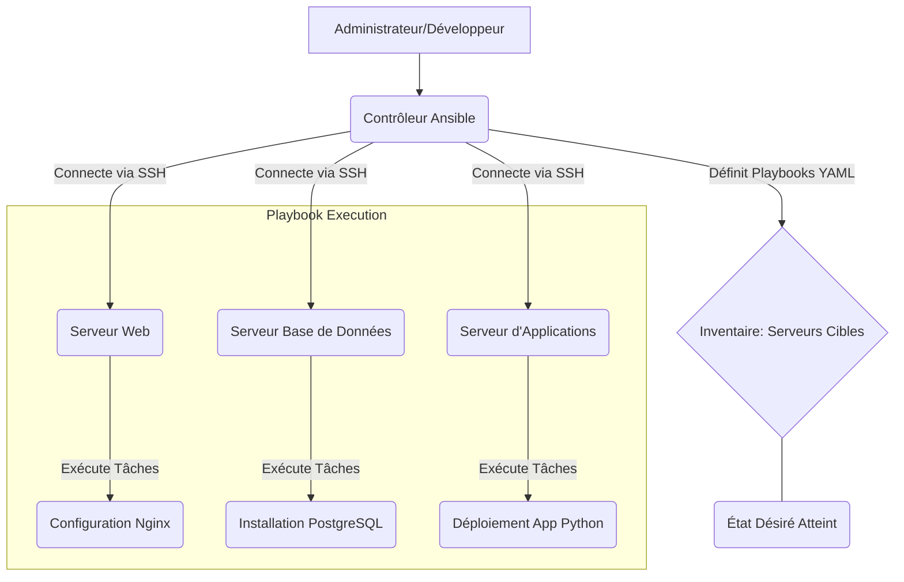
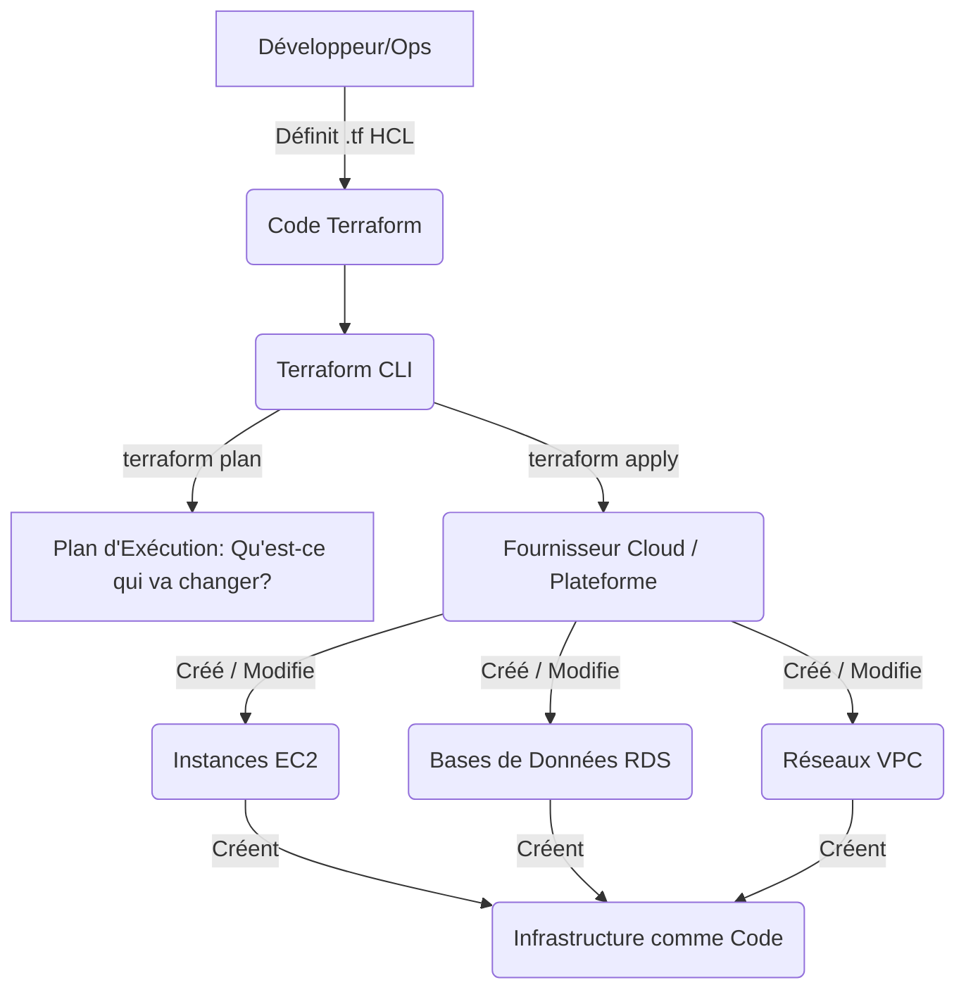

La gestion de configuration et l'orchestration de l'infrastructure sont des piliers fondamentaux de l'automatisation en DevOps et de l'administration système moderne. Alors que l'orchestration de workflow se concentre sur l'enchaînement des tâches logicielles, ces outils visent à automatiser la configuration, le déploiement et la gestion des serveurs, des réseaux et des applications qui les hébergent. En d'autres termes, ils transforment l'infrastructure en "code".

### Pourquoi automatiser la Gestion de Configuration et l'Orchestration ?

* **Cohérence :** Garantir que tous les environnements (développement, test, production) sont configurés de manière identique, réduisant les erreurs dues aux "différences de machines".
* **Rapidité :** Déployer de nouvelles machines ou mettre à jour des configurations en quelques minutes, et non en heures ou jours.
* **Répétabilité :** Pouvoir recréer un environnement entier à l'identique à tout moment, ce qui est crucial pour la reprise après sinistre.
* **Réduction des erreurs humaines :** Éliminer les tâches manuelles sujettes aux erreurs.
* **Scalabilité :** Gérer des centaines, voire des milliers de serveurs avec la même facilité que quelques-uns.
* **Documentation implicite :** Le code de configuration sert de documentation vivante de votre infrastructure.

### Concepts Clés

* **Infrastructure as Code (IaC) :** Le principe de gérer et provisionner l'infrastructure via du code plutôt que des processus manuels.
* **Idempotence :** Une opération est idempotente si l'appliquer plusieurs fois produit toujours le même résultat que de l'appliquer une seule fois. Les outils de gestion de configuration sont souvent idempotents.
* **Déclaration vs Impératif :**
    * **Déclaratif :** Vous décrivez l'état final désiré (ex: "Je veux que ce serveur ait Nginx installé et démarré"). L'outil détermine les étapes pour y arriver.
    * **Impératif :** Vous spécifiez les étapes précises à exécuter (ex: "Installer Nginx, puis démarrer le service Nginx, puis ouvrir le port 80").

### Outils Populaires

#### 1. Ansible

**Ansible** est un outil d'automatisation IT open source très populaire. Il est connu pour sa simplicité et son approche sans agent.

* **Approche :** Impérative (mais peut être utilisée de manière déclarative) et sans agent. Il utilise SSH pour se connecter aux machines cibles.
* **Langage :** YAML pour les Playbooks (fichiers de configuration et d'orchestration), ce qui le rend très lisible.
* **Points forts :**
    * **Facilité d'apprentissage :** Moins complexe à démarrer que d'autres outils.
    * **Sans agent :** Ne nécessite pas l'installation d'un logiciel spécifique sur les serveurs cibles.
    * **Puissant :** Capable de gérer des configurations simples aux déploiements complexes et orchestrations multi-tiers.
    * **Vaste communauté et modules :** Des modules intégrés pour interagir avec presque tous les systèmes imaginables (cloud providers, bases de données, services web, etc.).
* **Cas d'usage :** Déploiement d'applications, gestion des configurations de serveurs, orchestration de tâches système, mise à jour de parcs de machines.

*Figure 1 : Fonctionnement simplifié d'Ansible*

#### 2. Terraform (pour le Provisioning d'Infrastructure)

Alors qu'Ansible gère la configuration *sur* les serveurs, **Terraform** est un outil d'Infrastructure as Code (IaC) qui se concentre sur le **provisioning** et la **gestion du cycle de vie** de l'infrastructure elle-même (machines virtuelles, réseaux, bases de données, etc.) sur les fournisseurs de cloud (AWS, Azure, GCP) ou en local (VMware, OpenStack).

* **Approche :** Déclarative. Vous décrivez l'infrastructure souhaitée, et Terraform la crée ou la modifie pour correspondre à cet état.
* **Langage :** HCL (HashiCorp Configuration Language), simple et lisible.
* **Points forts :**
    * **Multi-cloud :** Supporte une multitude de fournisseurs de cloud et de services.
    * **Planification :** Permet de visualiser les changements que Terraform va effectuer avant de les appliquer (`terraform plan`).
    * **Gestion du cycle de vie :** Peut créer, modifier et détruire l'infrastructure de manière contrôlée.
* **Cas d'usage :** Création et gestion de serveurs virtuels, configuration de réseaux, déploiement de bases de données gérées, mise en place de l'infrastructure complète pour une application.

*Figure 2 : Fonctionnement simplifié de Terraform*

#### 3. Puppet / Chef (Mention)

**Puppet** et **Chef** sont des outils de gestion de configuration plus anciens et très robustes, souvent utilisés dans de grandes infrastructures d'entreprise.

* **Approche :** Principalement déclarative, avec une architecture client-serveur.
* **Langages :** Ruby DSL (pour Chef) ou leur propre DSL (pour Puppet).
* **Points forts :** Très matures, avec des capacités de gestion d'état avancées.
* **Quand l'utiliser :** Pour des environnements stables et complexes nécessitant une gestion d'état précise et des rapports détaillés.

### Orchestration de l'Infrastructure dans Votre Automatisation-ToolBox

Combiner ces outils est une stratégie puissante :
* Utilisez **Terraform** pour provisionner l'infrastructure sous-jacente (par exemple, créer des machines virtuelles).
* Utilisez **Ansible** pour configurer ces machines, y déployer votre application, et mettre en place des services comme Ollama.
* Utilisez un orchestrateur de workflow comme **Airflow** ou **Prefect** pour coordonner l'exécution de ces scripts Terraform et Ansible.

Cela vous permet de construire des pipelines d'automatisation de bout en bout, de l'infrastructure au déploiement de l'application et de ses services LLM locaux.

### Tableau Récapitulatif : Outils de Gestion de Configuration et d'Orchestration d'Infrastructure

| Caractéristique       | Ansible                           | Terraform                             | Puppet / Chef                       |
| :-------------------- | :-------------------------------- | :------------------------------------ | :---------------------------------- |
| **But Principal** | Gestion de configuration, déploiement d'applications, orchestration de tâches | Provisioning d'infrastructure (IaC), gestion du cycle de vie | Gestion de configuration, maintien de l'état |
| **Approche** | Sans agent (SSH), Impératif/Déclaratif | Sans agent (API Cloud), Déclaratif    | Basé sur agent, Déclaratif          |
| **Langage** | YAML                              | HCL (HashiCorp Configuration Language) | Ruby DSL / Puppet DSL               |
| **Focus** | Ce qui se passe *sur* le serveur | Ce qui se passe *avec* le serveur (création/destruction) | Comment le serveur *doit* être configuré et maintenu |
| **Cas d'usage typique** | Déploiement d'une app, maj OS      | Création de VM, réseaux, DB Cloud    | Conformité et état à long terme       |
| **Complexité Initiale** | Faible                             | Moyenne                               | Élevée                              |
