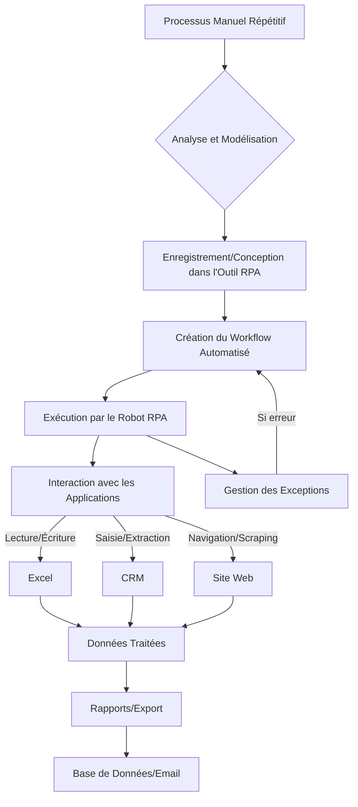

La Robotique Logicielle (RPA - Robotic Process Automation) est une technologie qui permet de créer des "robots" logiciels (ou "bots") pour automatiser des tâches numériques répétitives et basées sur des règles, **en interagissant avec les interfaces utilisateur des applications existantes**, de la même manière qu'un être humain. Contrairement aux scripts qui interagissent souvent en coulisses (via des APIs), le RPA simule les clics, les saisies au clavier et la navigation.

### Pourquoi Utiliser la RPA ?

La RPA est particulièrement utile dans des scénarios où :

* **Il n'y a pas d'API :** Les applications héritées (legacy systems) ou les logiciels bureautiques n'offrent souvent pas d'interface de programmation pour l'automatisation directe.
* **Les processus sont basés sur l'interface graphique :** La tâche implique de naviguer dans des menus, de copier-coller des données entre différentes applications (ERP, CRM, Excel, applications web).
* **Rapidité de déploiement :** Les robots RPA peuvent être développés et déployés relativement rapidement, car ils ne nécessitent généralement pas de modifications du système sous-jacent.
* **Réduction des erreurs humaines :** Les robots exécutent les tâches avec une précision constante, sans fatigue ni distraction.
* **Amélioration de l'efficacité :** Libère les employés des tâches répétitives pour qu'ils se concentrent sur des activités à plus forte valeur ajoutée.

### Comment fonctionne la RPA ?

Un robot RPA apprend un processus en observant un utilisateur l'exécuter, ou en étant programmé via des outils de conception visuelle. Il va ensuite rejouer ce processus :

1.  **Enregistrement/Conception :** L'utilisateur (ou le développeur RPA) enregistre les étapes du processus ou les construit visuellement (glisser-déposer des actions : "cliquer sur tel bouton", "saisir tel texte dans tel champ").
2.  **Exécution :** Le robot exécute les étapes sur l'interface graphique. Il peut ouvrir des applications, se connecter, extraire des données, copier-coller, générer des rapports, etc.
3.  **Gestion des exceptions :** Les outils RPA incluent des mécanismes pour gérer les erreurs, les fenêtres pop-up inattendues, ou les changements mineurs d'interface.

*Figure 4 : Cycle de vie d'un processus RPA*

### Outils de RPA Populaires

Le marché de la RPA est dominé par des solutions commerciales, mais il existe aussi des options open source ou des bibliothèques Python pour des cas plus spécifiques.

#### 1. UiPath

**UiPath** est l'un des leaders du marché de la RPA, offrant une suite complète d'outils pour la conception, le déploiement et la gestion des robots.

* **Points forts :**
    * **Studio :** Environnement de développement visuel puissant (glisser-déposer) pour créer des workflows complexes.
    * **Orchestrator :** Plateforme centralisée pour la gestion, la planification et la surveillance des robots.
    * **Large éventail d'activités :** Prise en charge de diverses applications (web, bureautiques, Citrix, SAP, etc.).
    * **Communauté et ressources :** Très grande communauté, nombreux tutoriels et certifications.
* **Quand l'utiliser :** Pour des déploiements RPA à l'échelle de l'entreprise, des processus critiques nécessitant une gestion centralisée, ou quand les tâches impliquent des applications sans API.
* **Exemple de cas d'usage :** Automatiser la saisie de commandes clients depuis des e-mails dans un système ERP, générer des factures à partir de données Excel, ou collecter des informations sur plusieurs sites web sans API.

#### 2. Power Automate Desktop (Microsoft)

**Power Automate Desktop** fait partie de la suite Microsoft Power Platform et est une solution RPA conviviale, particulièrement intégrée à l'écosystème Microsoft.

* **Points forts :**
    * **Intégration Microsoft :** Fonctionne très bien avec Excel, Outlook, SharePoint, Teams, et d'autres services Microsoft.
    * **Conception low-code/no-code :** Interface visuelle intuitive pour créer des "flows" de bureau.
    * **Version gratuite :** Une version desktop est disponible gratuitement pour les utilisateurs de Windows 10/11.
* **Quand l'utiliser :** Pour des automatisations personnelles ou au sein de petites équipes utilisant majoritairement des applications Microsoft, ou pour se familiariser avec la RPA.
* **Exemple de cas d'usage :** Collecter des données de différents rapports Excel et les consolider, automatiser l'envoi d'e-mails personnalisés basés sur des données extraites d'une application de bureau.

#### 3. TagUI / Robot Framework (Open Source)

Pour des solutions RPA plus légères ou pour des intégrations personnalisées, des outils open source comme **TagUI** ou des frameworks comme **Robot Framework** (avec ses bibliothèques de test d'interface graphique) peuvent être utilisés.

* **Points forts :**
    * **Gratuité :** Coût nul de licence.
    * **Flexibilité :** Peut être intégré dans des scripts Python ou d'autres langages.
    * **Contrôle fin :** Offre un contrôle plus granulaire pour les développeurs.
* **Quand l'utiliser :** Pour des automatisations spécifiques où les outils commerciaux sont trop coûteux ou trop complexes, ou pour l'apprentissage.
* **Exemple de cas d'usage :** Automatiser une interaction simple avec un formulaire web via un script Python, ou créer des tests d'interface utilisateur pour une application desktop.

### RPA dans Votre Automatisation-ToolBox

La RPA complète vos compétences en scripting et en orchestration. Si vous rencontrez une tâche répétitive qui :
* Implique une interface graphique.
* N'a pas d'API disponible.
* Ne justifie pas un développement logiciel complet.

Alors la RPA est l'outil à considérer. Elle est particulièrement efficace pour les "longues traînes" de processus métiers.

### Tableau Récapitulatif : Outils de Robotique Logicielle (RPA)

| Caractéristique       | UiPath                                 | Power Automate Desktop                 | TagUI / Robot Framework             |
| :-------------------- | :------------------------------------- | :------------------------------------- | :---------------------------------- |
| **Type** | Commercial, Leader du marché           | Microsoft, Intégré à Power Platform    | Open Source, Flexible               |
| **Conception** | Visuel (Studio), Low-Code              | Visuel (Flow Designer), Low-Code/No-Code | Scripting (TagUI DSL, Python)       |
| **Gestion** | Orchestrator centralisé                | Cloud (pour certains aspects), Local   | Manuelle, par scripts               |
| **Intégration** | Vaste (SAP, Citrix, Web, Office)       | Écosystème Microsoft optimisé          | Plus manuelle, via scripts          |
| **Coût** | Licences payantes (version Communauté gratuite) | Version Desktop gratuite, Cloud payant | Gratuit                             |
| **Complexité Initiale** | Moyenne à Élevée (pour la suite complète) | Faible à Moyenne                       | Moyenne (dépend de la complexité de l'automatisation) |
| **Cas d'usage** | Grands déploiements d'entreprise, processus critiques | Automatisations personnelles/petites équipes, écosystème MS | Besoins spécifiques, budgets limités, développeurs |
