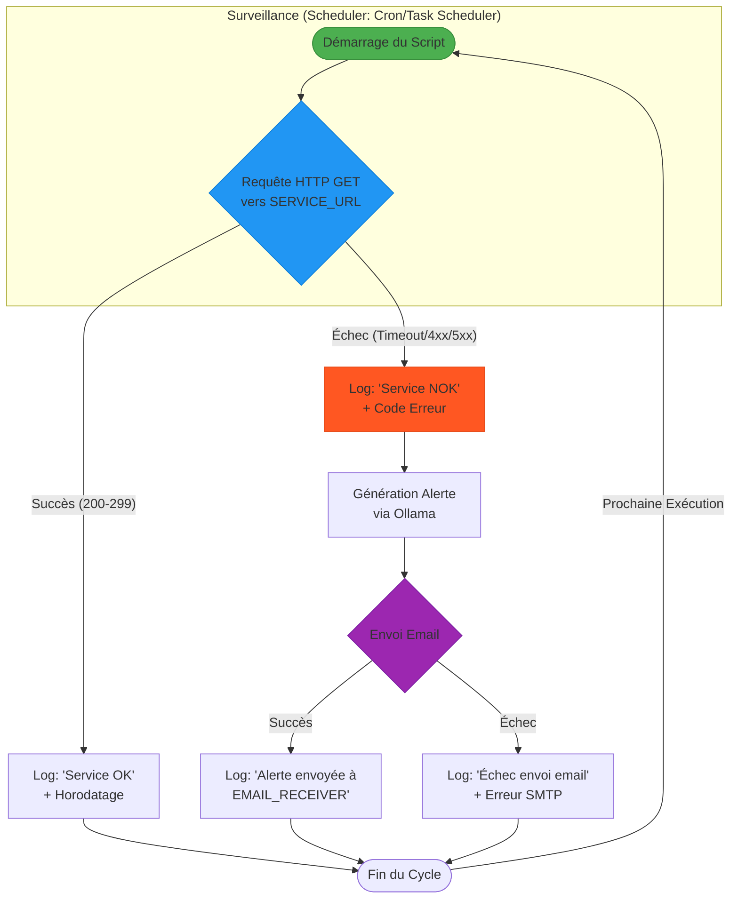

Ce tutoriel va vous guider à travers un cas pratique qui combine plusieurs des concepts et outils abordés précédemment : **surveiller la disponibilité d'un service web, générer un rapport si une anomalie est détectée, et envoyer une notification.**

Nous allons simuler la surveillance d'un service web (en l'occurrence, le site d'Ollama lui-même). Si le site ne répond pas correctement, nous utiliserons Ollama pour générer un message d'alerte concis et l'enverrons par email.

**Objectif :**
1.  Vérifier la disponibilité d'une URL.
2.  Si l'URL n'est pas accessible, demander à Ollama de générer un bref rapport d'incident.
3.  Envoyer ce rapport par email.
4.  Stocker les logs des vérifications dans un fichier.

**Outils utilisés :**
* **Python :** Langage de scripting principal.
* **`requests` :** Pour vérifier la disponibilité de l'URL.
* **`ollama` :** Pour générer le rapport d'incident.
* **`smtplib` / `email` :** Pour l'envoi d'emails.
* **`logging` :** Pour enregistrer les événements.

### Étape 1 : Préparation de l'Environnement

Assurez-vous que les bibliothèques Python nécessaires sont installées :

```powershell
pip install requests ollama
```

*Pour l'envoi d'e-mails, vous n'avez pas besoin d'une installation `pip` supplémentaire pour `smtplib` et `email`, car elles sont intégrées à la bibliothèque standard de Python.*

### Étape 2 : Configuration du Projet et du Script

Créez un dossier `surveillance_service/` dans votre projet.
```
mon_projet_automatisation/
├── notebooks/
│   └── ...
├── data/
│   └── ...
├── scripts/
│   └── ...
├── surveillance_service/
│   ├── check_service.py       # Le script principal de surveillance
│   ├── service_check_log.txt  # Fichier de log des vérifications
│   └── .env                   # Pour les identifiants d'email (très important !)
└── README.md
```

**Fichier `.env`** (Créez ce fichier dans `surveillance_service/`)
Ce fichier contiendra vos informations d'identification d'email. **NE PARTAGEZ PAS CE FICHIER NI VOS IDENTIFIANTS !**

```dotenv
# .env
EMAIL_SENDER="votre_email@exemple.com"
EMAIL_PASSWORD="votre_mot_de_passe_ou_mot_de_passe_app" # Pour Gmail, utilisez un "mot de passe d'application"
EMAIL_RECEIVER="destinataire_alerte@exemple.com"
SMTP_SERVER="smtp.exemple.com" # Ex: smtp.gmail.com pour Gmail
SMTP_PORT=587 # Port TLS/STARTTLS, Ex: 587 pour Gmail
```
* **Gmail :** Si vous utilisez Gmail, vous devrez générer un "mot de passe d'application" via les paramètres de sécurité de votre compte Google, car les mots de passe habituels ne fonctionnent pas directement pour des raisons de sécurité. Recherchez "Générer un mot de passe d'application Gmail".

**Fichier `check_service.py`** (Créez ce fichier dans `surveillance_service/`)

```python
# check_service.py

import requests
import ollama
import smtplib
from email.mime.text import MIMEText
from email.mime.multipart import MIMEMultipart
import os
import datetime
import logging
from dotenv import load_dotenv # pip install python-dotenv

# --- 0. Chargement des variables d'environnement ---
# Assurez-vous que le fichier .env est dans le même répertoire que ce script
load_dotenv()

# --- 1. Configurations ---
SERVICE_URL = "https://ollama.com/" # L'URL du service à surveiller
OLLAMA_MODEL = "llama3" # Modèle Ollama pour les alertes
TIMEOUT_SECONDS = 10 # Délai d'attente pour la réponse HTTP

# Configurations Email (chargées depuis .env)
EMAIL_SENDER = os.getenv("EMAIL_SENDER")
EMAIL_PASSWORD = os.getenv("EMAIL_PASSWORD") # Mot de passe d'application pour Gmail
EMAIL_RECEIVER = os.getenv("EMAIL_RECEIVER")
SMTP_SERVER = os.getenv("SMTP_SERVER")
SMTP_PORT = int(os.getenv("SMTP_PORT", 587)) # Assurez-vous que le port est un entier

# Chemin du fichier de log
LOG_FILE = "service_check_log.txt"

# --- 2. Configuration du Logging ---
logging.basicConfig(
    level=logging.INFO,
    format='%(asctime)s - %(levelname)s - %(message)s',
    handlers=[
        logging.FileHandler(LOG_FILE),
        logging.StreamHandler() # Affiche aussi dans la console
    ]
)

# --- 3. Fonctions d'Automatisation ---

def check_service_availability(url):
    """Vérifie si l'URL est accessible et renvoie un code de statut HTTP."""
    logging.info(f"Vérification de la disponibilité de {url}...")
    try:
        response = requests.get(url, timeout=TIMEOUT_SECONDS)
        response.raise_for_status()  # Lève une exception pour les codes d'erreur HTTP (4xx ou 5xx)
        logging.info(f"Service {url} est accessible. Statut: {response.status_code}")
        return True, response.status_code
    except requests.exceptions.Timeout:
        logging.error(f"Délai d'attente dépassé pour {url}.")
        return False, "Timeout"
    except requests.exceptions.RequestException as e:
        logging.error(f"Erreur de connexion ou HTTP pour {url}: {e}")
        return False, str(e)
    except Exception as e:
        logging.error(f"Erreur inattendue lors de la vérification de {url}: {e}")
        return False, str(e)

def generate_alert_message(service_url, status_info, model=OLLAMA_MODEL):
    """Génère un message d'alerte concis avec Ollama."""
    logging.info(f"Génération du message d'alerte avec Ollama pour {service_url}...")
    try:
        prompt = (f"Un service web à l'URL '{service_url}' est actuellement indisponible ou a rencontré une erreur. "
                  f"Le statut ou l'erreur est : '{status_info}'. "
                  "Rédigez un court message d'alerte professionnel et concis de 2-3 phrases pour informer l'équipe technique.")
        
        response = ollama.generate(model=model, prompt=prompt)
        alert_text = response['response'].strip()
        logging.info("Message d'alerte généré par Ollama.")
        return alert_text
    except ollama.ResponseError as e:
        logging.error(f"Erreur Ollama lors de la génération de l'alerte : {e}. Modèle {model} non disponible ?")
        return f"ALERTE : Service {service_url} indisponible. Erreur de communication avec le LLM pour générer un message détaillé. Statut: {status_info}"
    except Exception as e:
        logging.error(f"Erreur inattendue lors de la génération de l'alerte : {e}")
        return f"ALERTE : Service {service_url} indisponible. Impossible de générer un message détaillé. Statut: {status_info}"

def send_email_alert(subject, body):
    """Envoie un email d'alerte."""
    if not EMAIL_SENDER or not EMAIL_PASSWORD or not EMAIL_RECEIVER or not SMTP_SERVER:
        logging.error("Configuration d'email incomplète. Impossible d'envoyer l'alerte.")
        return False

    logging.info(f"Tentative d'envoi d'e-mail à {EMAIL_RECEIVER}...")
    
    msg = MIMEMultipart()
    msg['From'] = EMAIL_SENDER
    msg['To'] = EMAIL_RECEIVER
    msg['Subject'] = subject
    msg.attach(MIMEText(body, 'plain'))

    try:
        with smtplib.SMTP(SMTP_SERVER, SMTP_PORT) as server:
            server.starttls()  # Mettre en place la sécurité TLS
            server.login(EMAIL_SENDER, EMAIL_PASSWORD)
            server.send_message(msg)
        logging.info("E-mail d'alerte envoyé avec succès.")
        return True
    except smtplib.SMTPAuthenticationError:
        logging.error("Échec d'authentification SMTP. Vérifiez l'expéditeur, le mot de passe et/ou le mot de passe d'application.")
        return False
    except smtplib.SMTPConnectError as e:
        logging.error(f"Impossible de se connecter au serveur SMTP: {e}. Vérifiez le serveur et le port.")
        return False
    except Exception as e:
        logging.error(f"Erreur lors de l'envoi de l'e-mail: {e}")
        return False

# --- 4. Fonction Principale d'Exécution ---
def main():
    logging.info("--- Démarrage de la vérification du service ---")
    
    is_available, status_info = check_service_availability(SERVICE_URL)
    
    if not is_available:
        logging.warning(f"Le service {SERVICE_URL} est indisponible ou a rencontré une erreur : {status_info}")
        alert_message = generate_alert_message(SERVICE_URL, status_info)
        subject = f"ALERTE : Indisponibilité du service {SERVICE_URL}"
        
        logging.info("Contenu de l'alerte à envoyer :")
        logging.info(alert_message)
        
        send_email_alert(subject, alert_message)
    else:
        logging.info(f"Le service {SERVICE_URL} fonctionne correctement.")
    
    logging.info("--- Fin de la vérification du service ---")

if __name__ == "__main__":
    # Assurez-vous que Ollama est bien démarré en arrière-plan
    # et que le modèle 'llama3' est téléchargé.
    main()

```

### Étape 3 : Exécution du Cas Pratico-Pratique

1.  **Vérifiez Ollama et Llama 3 :** Assurez-vous que le serveur Ollama est démarré et que `llama3` est bien installé (`ollama run llama3`).
2.  **Configurez le fichier `.env` :** Remplacez les placeholders avec vos propres informations d'email.
3.  **Exécutez le script :** Ouvrez votre PowerShell ou Terminal, naviguez jusqu'au répertoire `surveillance_service/` et exécutez :
    ```powershell
    python check_service.py
    ```

### Scénarios et Résultats Attendus :

* **Si `https://ollama.com/` est accessible (normalement) :** Le script enregistrera dans le log et affichera dans la console que le service est disponible. Aucun e-mail ne sera envoyé.
* **Si `https://ollama.com/` était inaccessible (simulez en changeant l'URL vers `http://nonexistent.domain/` ou en coupant votre connexion internet) :**
    * Le script détectera l'erreur.
    * Il utilisera Ollama pour générer un message d'alerte concis.
    * Un e-mail sera envoyé au `EMAIL_RECEIVER` avec le message d'alerte.
    * Toutes les étapes (tentative, succès/échec, envoi d'email) seront consignées dans `service_check_log.txt`.


*Figure 5 : Diagramme de flux du cas pratique de surveillance et notification*

### Prochaines Étapes pour ce cas pratique :

* **Planification :** Utilisez le Planificateur de tâches de Windows ou Cron (sur Linux/macOS) pour exécuter ce script toutes les 5 minutes, 15 minutes, ou à la fréquence souhaitée.
* **Seuils d'alerte :** Pour éviter les alertes intempestives (flapping), vous pourriez implémenter une logique qui n'envoie une alerte qu'après plusieurs échecs consécutifs.
* **Contenu de l'alerte :** Personnalisez le prompt donné à Ollama pour des messages d'alerte plus spécifiques ou incluant plus de détails techniques si nécessaire.
* **Notifications alternatives :** Au lieu d'un e-mail, vous pourriez envoyer la notification à Slack, Teams, ou une plateforme de monitoring dédiée.
* **Gestion de l'état :** Enregistrer l'état du service (UP/DOWN) dans un petit fichier persistant pour ne pas envoyer d'alerte à chaque fois si le service est déjà connu comme étant en panne.

Ce cas pratique démontre comment les bases du scripting, l'intégration de LLM locaux (Ollama) et les mécanismes de notification peuvent être combinés pour créer une automatisation utile et résiliente.

---

### Tableau Récapitulatif : Concepts et Outils du Cas Pratico-Pratique

| Concept / Outil | Rôle dans l'Automatisation                                 | Utilisation Spécifique dans le Cas Pratique             |
| :-------------- | :--------------------------------------------------------- | :------------------------------------------------------ |
| **Python** | Langage de scripting général, glue pour tous les composants | Orchestre le flux, exécute les fonctions de vérification, génération et envoi. |
| **`requests`** | Requêtes HTTP, interaction avec services web               | Vérifie la disponibilité de l'URL cible (`https://ollama.com/`). |
| **Ollama** | Exécution de LLM locaux                                   | Génère un résumé concis de l'incident pour l'alerte email. |
| **`smtplib`** | Envoi d'emails via SMTP                                   | Envoie l'email d'alerte à l'équipe technique.             |
| **`email`** | Construction des messages email                            | Prépare le format de l'email (objet, corps, expéditeur/destinataire). |
| **`.env`** | Stockage sécurisé des variables d'environnement           | Contient les identifiants SMTP de manière sécurisée.    |
| **`logging`** | Enregistrement des événements et erreurs                   | Trace toutes les étapes (vérification, alerte, envoi) dans un fichier et la console. |
| **Ordonnancement (futur)** | Exécution périodique de tâches                 | Le script est conçu pour être lancé par un ordonnanceur (Cron/Planificateur). |