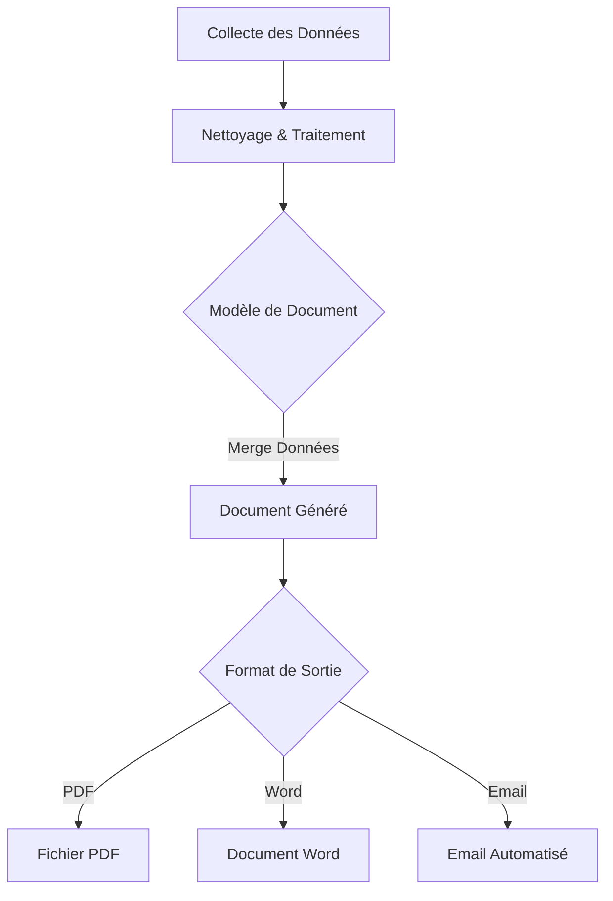

La génération de rapports et de documents est une tâche répétitive et souvent chronophage dans de nombreuses organisations. Qu'il s'agisse de rapports financiers mensuels, de fiches produits, de lettres personnalisées, ou de résumés d'activités, automatiser ce processus permet de gagner un temps précieux, de réduire les erreurs et d'assurer une cohérence dans la présentation.

### Pourquoi Automatiser la Génération de Rapports et Documents ?

* **Gain de Temps :** Élimine la saisie manuelle et le formatage répétitifs.
* **Précision :** Réduit les erreurs humaines inhérentes à la manipulation manuelle de données.
* **Cohérence :** Assure que tous les documents respectent un format et un style uniformes.
* **Actualisation :** Permet de générer des rapports à jour plus fréquemment, voire en temps réel.
* **Personnalisation à Grande Échelle :** Crée des documents uniques pour un grand nombre de destinataires à partir de modèles.

### Processus d'Automatisation Typique

L'automatisation de la génération de rapports et de documents suit généralement un schéma en plusieurs étapes :

1.  **Collecte des Données :** Extraction des informations pertinentes de diverses sources (bases de données, fichiers Excel, APIs, scraping web).
2.  **Traitement des Données :** Nettoyage, transformation et agrégation des données pour les rendre prêtes à être insérées dans le document.
3.  **Application du Modèle :** Insertion des données traitées dans un modèle de document prédéfini (Word, PDF, HTML, Excel, PowerPoint).
4.  **Export/Distribution :** Sauvegarde du document généré dans le format désiré et distribution (e-mail, partage de fichiers, stockage cloud).

*Figure 6 : Flux de travail pour l'automatisation de la génération de rapports et documents*

### Outils et Technologies Clés

Les outils varient en fonction du format de document cible et de la complexité du processus.

#### 1. Python avec Pandas et Jinja2 (HTML/PDF/Texte)

Cette combinaison est extrêmement flexible pour générer des rapports textuels, HTML, et même des PDF complexes via HTML/CSS.

* **Pandas :** Excellent pour la collecte, le nettoyage et la manipulation des données.
* **Jinja2 :** Un moteur de templates Python qui permet de créer des modèles de documents (souvent HTML) où les données sont insérées dynamiquement. Très puissant pour des rapports structurés.
* **`WeasyPrint` / `ReportLab` :** Bibliothèques Python pour convertir des HTML/CSS en PDF (`WeasyPrint`) ou générer des PDF programmatique (`ReportLab`).

* **Points forts :**
    * **Flexibilité maximale :** Contrôle total sur la mise en page et le contenu.
    * **Interopérabilité :** Facilement intégrable dans des pipelines de données Python existants.
    * **Puissant pour le web :** Idéal si vos rapports peuvent être visualisés ou exportés en HTML/PDF.
* **Cas d'usage :** Génération de rapports personnalisés pour des clients, création de factures dynamiques, bulletin d'information automatisé, fiches produits pour un site web.

#### 2. Python avec `python-docx` / `openpyxl` / `python-pptx` (Microsoft Office)

Ces bibliothèques permettent de manipuler directement les formats de fichiers Microsoft Office (Word, Excel, PowerPoint) sans avoir besoin d'Office installé.

* **`python-docx` :** Pour créer, modifier et générer des documents Word (`.docx`).
* **`openpyxl` :** Pour lire, écrire et manipuler des fichiers Excel (`.xlsx`). Indispensable si vos données source ou cible sont des feuilles de calcul.
* **`python-pptx` :** Pour créer et modifier des présentations PowerPoint (`.pptx`).

* **Points forts :**
    * **Compatibilité Office :** Idéal pour les environnements où les documents Office sont le standard.
    * **Automatisation de tâches métiers :** Nombreux cas d'usage en finance, RH, ventes.
* **Cas d'usage :** Génération de contrats Word pré-remplis, mise à jour automatique de tableaux de bord Excel, création de présentations PowerPoint à partir de données.

#### 3. Power Automate (Microsoft) / Zapier / Make (No-Code/Low-Code)

Pour des cas de génération de documents plus simples ou pour les utilisateurs sans compétences en programmation, les plateformes d'automatisation sans code/low-code sont très efficaces.

* **Points forts :**
    * **Facilité d'utilisation :** Interface glisser-déposer.
    * **Connecteurs :** Intégration facile avec des centaines d'applications cloud (Google Docs, SharePoint, Salesforce, etc.).
* **Cas d'usage :** Générer une lettre Word à partir d'une nouvelle entrée dans un formulaire Google Forms, créer un PDF à partir d'un email, remplir un modèle de document Office 365 avec des données d'une feuille de calcul.

### Intégration des LLM (Ollama)

Les LLM comme Llama 3 (via Ollama) peuvent ajouter une couche d'intelligence à la génération de documents :

* **Génération de contenu :** Écrire des résumés, des introductions, des conclusions ou des paragraphes entiers pour vos rapports.
* **Personnalisation :** Adapter le ton ou le style d'un message en fonction du destinataire ou des données.
* **Formulation :** Reformuler des données brutes en texte compréhensible et bien articulé.

**Exemple d'intégration :**
1.  Extraire des chiffres clés d'une feuille Excel avec `openpyxl`.
2.  Demander à Ollama de générer une interprétation textuelle de ces chiffres (ex: "Les ventes ont augmenté de X% ce mois-ci, principalement tirées par...").
3.  Insérer cette interprétation dans un rapport Word avec `python-docx`.

### Tableau Récapitulatif : Outils de Génération de Rapports et Documents

| Outil / Technologie | Format de Document Principal | Points Forts                                   | Cas d'Usage Typique                                  |
| :------------------ | :--------------------------- | :--------------------------------------------- | :--------------------------------------------------- |
| **Python + Pandas + Jinja2 + WeasyPrint** | HTML, PDF, Texte             | Très flexible, contrôle total, idéal pour rapports web | Rapports clients personnalisés, factures, bulletins. |
| **Python + `python-docx`, `openpyxl`, `python-pptx`** | Word, Excel, PowerPoint      | Excellente compatibilité Office, manipulation directe | Contrats, tableaux de bord Excel, présentations.     |
| **Power Automate / Zapier / Make** | Divers (via connecteurs)     | Sans code/Low-code, intégration facile avec SaaS     | Génération simple de documents basée sur des événements. |
| **Ollama (LLM)** | Contenu textuel              | Génération intelligente de texte, résumé       | Ajouter du texte narratif, interpréter des données.  |
