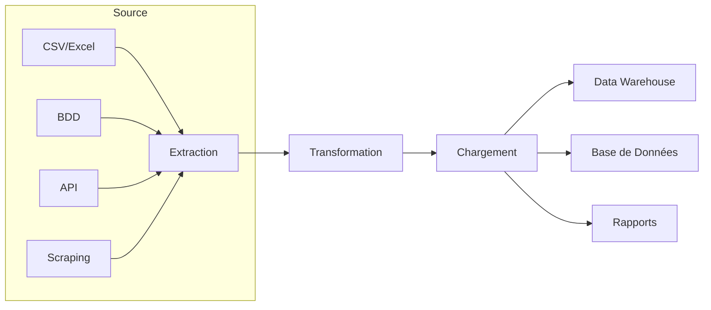

L'intégration et la transformation de données (souvent appelée ETL - Extract, Transform, Load ou ELT) sont au cœur de presque toutes les automatisations sophistiquées. Les données sont rarement dans le format idéal pour l'analyse ou l'utilisation directe. L'automatisation dans ce domaine consiste à collecter des données de diverses sources, à les nettoyer et à les remodeler, puis à les charger vers une destination où elles peuvent être exploitées.

### Pourquoi Automatiser l'Intégration et la Transformation des Données ?

* **Unification des Sources :** Consolider les données provenant de systèmes disparates (bases de données, fichiers plats, APIs, web).
* **Qualité des Données :** Nettoyer les données (supprimer les doublons, corriger les erreurs, gérer les valeurs manquantes) pour garantir leur fiabilité.
* **Conformité des Formats :** Transformer les données dans un format compatible avec le système de destination ou les besoins d'analyse.
* **Actualisation des Données :** Maintenir les bases de données et les rapports à jour avec les informations les plus récentes.
* **Support à la Décision :** Préparer des données fiables et structurées pour l'analyse et la Business Intelligence.

### Le Cycle ETL/ELT

*Figure 7 : Cycle Extract, Transform, Load (ETL)*

* **Extraction (E) :** Collecter les données brutes des systèmes sources.
* **Transformation (T) :** Nettoyer, filtrer, agréger, joindre, et modifier les données. C'est l'étape la plus complexe et la plus consommatrice de ressources.
* **Chargement (L) :** Déplacer les données transformées vers un système de destination (base de données, entrepôt de données, fichier).

### Outils et Technologies Clés

Les outils varient en fonction de l'échelle, de la complexité et des types de données.

#### 1. Python avec Pandas (Polyvalent)

**Pandas** est LA bibliothèque Python pour la manipulation et l'analyse de données. C'est l'outil de choix pour des pipelines ETL de petite à moyenne envergure, ou pour des étapes de transformation spécifiques.

* **Points forts :**
    * **Puissant :** Gère de grandes quantités de données en mémoire, avec des opérations optimisées.
    * **Intuitif :** API conviviale pour le nettoyage, la fusion, le filtrage, et l'agrégation de données.
    * **Connectivité :** Peut lire et écrire dans de nombreux formats (CSV, Excel, SQL, JSON, Parquet, etc.).
* **Cas d'usage :**
    * Consolider des données de plusieurs fichiers Excel en un seul DataFrame.
    * Nettoyer des données client (supprimer les doublons, standardiser les adresses).
    * Calculer des agrégats (ventes mensuelles, nombre d'utilisateurs actifs).
    * **Intégration Ollama :** Envoyer des colonnes de texte à Ollama pour classification, résumé, ou normalisation avant de les réintégrer au DataFrame.

#### 2. SQL (Bases de Données Relationnelles)

Le langage SQL est indispensable pour extraire, transformer et charger des données directement au sein des bases de données relationnelles.

* **Points forts :**
    * **Performant :** Les opérations sont exécutées directement par le moteur de base de données, souvent très optimisées.
    * **Déclaratif :** Facile à lire et à comprendre pour les opérations sur les données.
    * **Intégration :** Peut être appelé depuis n'importe quel langage de script (Python avec `psycopg2`, `mysql-connector`, etc.).
* **Cas d'usage :**
    * Joindre des tables pour créer des vues agrégées.
    * Filtrer des enregistrements basés sur des critères complexes.
    * Insérer, mettre à jour ou supprimer des données en masse.

#### 3. Outils ETL Dédiés (ex: Apache NiFi, Talend, Pentaho Data Integration)

Pour des pipelines ETL plus complexes, à l'échelle de l'entreprise, ou nécessitant des interfaces visuelles, les outils ETL dédiés sont préférables.

* **Apache NiFi :** Un système puissant et flexible pour automatiser le flux de données entre les systèmes, avec une interface visuelle pour concevoir les "dataflows". Idéal pour le traitement de flux de données en temps réel.
* **Talend / Pentaho Data Integration (Kettle) :** Des solutions ETL robustes (commerciales ou open source) avec des interfaces graphiques pour concevoir des mappings et transformations complexes sans écrire de code.

* **Points forts :**
    * **Évolutivité :** Conçus pour gérer de très grands volumes de données.
    * **Visuel :** Simplifient la conception de pipelines complexes.
    * **Connectivité :** Supportent un très grand nombre de sources et destinations de données.
* **Cas d'usage :** Migrations de bases de données, synchronisation de données entre systèmes hétérogènes, construction de Data Warehouses.

### Intégration du NLP (Ollama) dans la Transformation de Données

Les LLM comme Ollama peuvent transformer la façon dont nous traitons les données textuelles non structurées lors de l'étape de transformation (T) :

* **Normalisation de Texte :** Nettoyer des entrées utilisateur (ex: "Strasbourg", "Stras", "strasbg") en une forme standardisée.
* **Enrichissement de Données :** Ajouter des tags ou des catégories à des articles, des produits ou des commentaires en se basant sur leur contenu textuel.
* **Dédoublonnage Intelligent :** Utiliser des embeddings de texte pour identifier des doublons sémantiques plutôt que juste des correspondances exactes.
* **Structuration de l'Information :** Extraire des entités ou des faits clés à partir de texte libre pour les insérer dans des colonnes structurées.

**Exemple d'intégration avec Ollama :**
1.  Extraire une colonne de descriptions de produits brutes d'une base de données.
2.  Pour chaque description, demander à Ollama de générer une liste de 3-5 mots-clés pertinents.
3.  Ajouter ces mots-clés comme une nouvelle colonne dans la base de données.

### Tableau Récapitulatif : Outils d'Intégration et de Transformation de Données

| Outil / Technologie | Force Principale               | Cas d'Usage Typique                                  | Intégration avec Ollama Possible ? |
| :------------------ | :----------------------------- | :--------------------------------------------------- | :--------------------------------- |
| **Python + Pandas** | Manipulation de données en mémoire | Nettoyage de fichiers CSV, fusion de tables, agrégations | Oui (pour traitement de colonnes de texte) |
| **SQL** | Transformation in-database     | Requêtes complexes, jointures, agrégations, ETL natif | Oui (si SQL gère UDF Python ou via script externe) |
| **Apache NiFi** | Flux de données en temps réel, ETL visuel | Ingestion de logs, synchronisation de bases de données distribuées | Oui (via processeurs d'exécution de scripts ou appels HTTP) |
| **Talend / Pentaho** | ETL visuel, Enterprise-grade   | Data Warehousing, migration de données complexes     | Oui (via composants d'exécution de scripts ou appels API) |
| **Ollama (LLM)** | Transformation sémantique de texte | Normalisation textuelle, catégorisation, extraction structurée depuis texte libre | N/A (c'est une capacité de transformation) |
