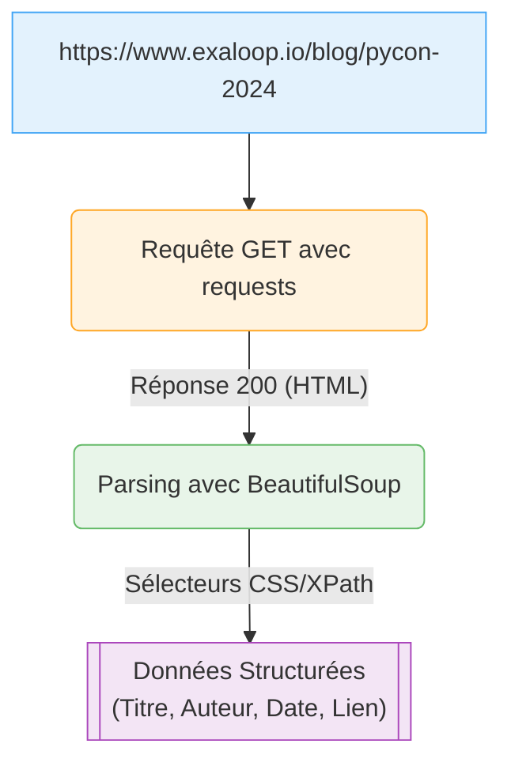
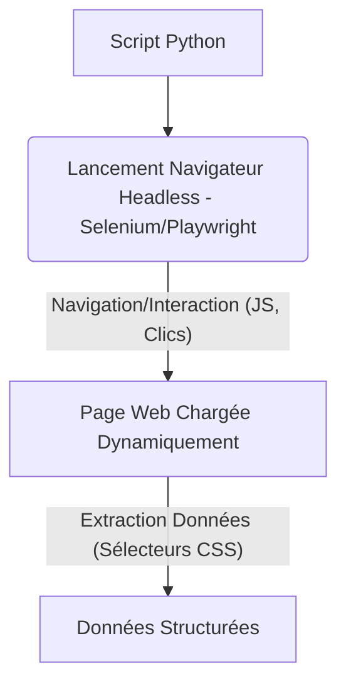

# 02 Interactions web
Le web est une source inépuisable de données et un environnement où de nombreuses tâches répétitives peuvent être automatisées. Que ce soit pour collecter des informations, interagir avec des services en ligne, ou même tester des applications web, maîtriser l'automatisation des interactions web est une compétence clé.

### Pourquoi Automatiser les Interactions Web ?

* **Web Scraping / Collecte de Données :** Récupérer des informations spécifiques (prix, actualités, listes de produits) de sites web pour analyse ou intégration.
* **Surveillance :** Garder un œil sur les changements de prix, la disponibilité de produits, ou les mises à jour de contenu sur des pages web.
* **Interactions Répétitives :** Remplir des formulaires, se connecter à des sites, télécharger des rapports, ou cliquer sur des boutons de manière répétée.
* **Tests d'Applications Web :** Simuler le comportement d'un utilisateur pour s'assurer qu'une application web fonctionne comme prévu.
* **Intégration d'APIs :** Automatiser l'envoi et la réception de données avec des services web qui offrent une API.

### Concepts Clés

* **HTTP (Hypertext Transfer Protocol) :** Le protocole de communication du web.
    * **GET :** Demander une ressource (ex: afficher une page web).
    * **POST :** Envoyer des données au serveur (ex: soumettre un formulaire).
    * **Response :** La réponse du serveur (code de statut, contenu HTML/JSON).
* **HTML (Hypertext Markup Language) :** Le langage de structuration du contenu des pages web.
* **CSS Selectors / XPath :** Langages pour localiser des éléments spécifiques dans le HTML d'une page.
* **API (Application Programming Interface) :** Un ensemble de règles et de protocoles qui permet à différentes applications de communiquer entre elles. Les APIs RESTful sont très courantes pour le web.
* **Navigateur Headless :** Un navigateur web sans interface graphique, souvent utilisé pour le scraping ou les tests automatisés car plus rapide et moins gourmand en ressources.

### Outils Python pour les Interactions Web

#### 1. `requests` (Requêtes HTTP)

Le module `requests` est la bibliothèque Python de facto pour faire des requêtes HTTP. C'est votre premier outil pour interagir avec des APIs ou télécharger le contenu de pages web.

* **Utilisation :**
    ```python
    import requests
    response = requests.get("https://example.com")
    print(response.status_code)
    print(response.text) # Contenu HTML ou JSON
    ```
* **Points forts :** Simple, élégant, gère bien les sessions, les paramètres, l'authentification.
* **Limitation :** Ne "rend" pas la page web (ne charge pas le JavaScript, les CSS), donc inadapté pour le scraping de sites dynamiques.

#### 2. `BeautifulSoup` (Parsing HTML / Web Scraping Statique)

Une fois que vous avez le contenu HTML d'une page avec `requests`, `BeautifulSoup` est l'outil parfait pour extraire des informations.

* **Utilisation :**
    ```python
    from bs4 import BeautifulSoup
    import requests
    response = requests.get("https://pycon.blogspot.com/")
    soup = BeautifulSoup(response.text, 'html.parser')
    # Trouver tous les titres des articles (exemple spécifique au site)
    titles = [h3.get_text() for h3 in soup.find_all('h3', class_='post-title')]
    print(titles)
    ```
* **Points forts :** Facile à utiliser, excellent pour naviguer dans l'arborescence HTML, rechercher des éléments par balise, classe, ID.
* **Limitation :** Ne peut pas interagir avec JavaScript.


*Figure 8 : Flux de Web Scraping Statique avec `requests` et `BeautifulSoup`*

#### 3. Selenium / Playwright (Automatisation de Navigateur / Web Scraping Dynamique)

Pour les sites qui chargent du contenu via JavaScript, nécessitent des clics ou des interactions complexes, vous avez besoin d'un navigateur automatisé.

* **Selenium :** Outil historique pour l'automatisation des navigateurs web.
* **Playwright :** Plus récent, souvent plus rapide et plus stable que Selenium, supporte Python, Node.js, Java, .NET.

* **Utilisation (Playwright - exemple simplifié) :**
    ```python
    # Nécessite 'pip install playwright' et 'playwright install'
    # from playwright.sync_api import sync_playwright
    # with sync_playwright() as p:
    #     browser = p.chromium.launch()
    #     page = browser.new_page()
    #     page.goto("https://dynamic-website.com")
    #     page.click("#some_button")
    #     content = page.inner_text("#data_element")
    #     print(content)
    #     browser.close()
    ```
* **Points forts :** Interagit comme un humain (clique, saisit, attend), gère JavaScript, authentification complexe, téléchargements.
* **Limitations :** Plus lent et gourmand en ressources que `requests` car il lance un navigateur complet.


*Figure 9 : Flux de Web Scraping Dynamique avec Selenium/Playwright*

### Exemples Pratiques d'Automatisation

#### Exemple 1 : Vérifier le Prix d'un Produit sur un Site Statique

```python
# Exemple_web_interactions.py (partie 1)
import requests
from bs4 import BeautifulSoup

def check_product_price(url, product_selector):
    """Vérifie le prix d'un produit sur une page web statique."""
    try:
        response = requests.get(url, timeout=10)
        response.raise_for_status() # Lève une erreur pour les codes 4xx/5xx
        soup = BeautifulSoup(response.text, 'html.parser')
        
        # Le sélecteur dépend du site. Exemple : 'span.price' ou 'div#product-price'
        price_element = soup.select_one(product_selector) 
        
        if price_element:
            price = price_element.get_text(strip=True)
            print(f"Prix trouvé sur {url} : {price}")
            return price
        else:
            print(f"Prix non trouvé avec le sélecteur '{product_selector}' sur {url}.")
            return None
    except requests.exceptions.RequestException as e:
        print(f"Erreur de connexion/HTTP pour {url}: {e}")
        return None
    except Exception as e:
        print(f"Erreur lors du parsing de la page : {e}")
        return None

# Utilisation (exemple avec un site hypothétique, adaptez l'URL et le sélecteur)
# URL_PRODUIT = "https://example.com/produit/super-gadget"
# SELECTEUR_PRIX = "span.product-price" # Ceci est un exemple, inspectez la page pour le bon sélecteur
# current_price = check_product_price(URL_PRODUIT, SELECTEUR_PRIX)
# if current_price:
#     print(f"Le prix actuel est : {current_price}")
```
*Pour tester cet exemple, vous devrez trouver une page web statique avec un prix et identifier le sélecteur CSS correct (par ex. clic droit sur le prix dans votre navigateur -> Inspecter l'élément, et cherchez les classes ou IDs).*

#### Exemple 2 : Interaction avec une API REST (simulé)

De nombreux services offrent des APIs REST pour interagir avec leurs données de manière structurée.

```python
# Exemple_web_interactions.py (partie 2)
import requests
import json # Pour travailler avec des données JSON

# URL d'une API de test publique (JSONPlaceholder)
API_BASE_URL = "https://jsonplaceholder.typicode.com"

def get_posts():
    """Récupère une liste d'articles depuis une API."""
    try:
        response = requests.get(f"{API_BASE_URL}/posts", timeout=10)
        response.raise_for_status()
        posts = response.json() # Convertit la réponse JSON en objet Python
        print(f"Récupéré {len(posts)} articles.")
        return posts
    except requests.exceptions.RequestException as e:
        print(f"Erreur lors de la récupération des posts : {e}")
        return []

def create_new_post(title, body, user_id):
    """Crée un nouvel article via l'API (simulation)."""
    new_post_data = {
        "title": title,
        "body": body,
        "userId": user_id
    }
    try:
        response = requests.post(f"{API_BASE_URL}/posts", json=new_post_data, timeout=10)
        response.raise_for_status()
        created_post = response.json()
        print(f"Nouvel article créé (ID: {created_post.get('id')}): {created_post}")
        return created_post
    except requests.exceptions.RequestException as e:
        print(f"Erreur lors de la création de l'article : {e}")
        return None

# --- Exécution des exemples ---
print("--- Test des interactions API ---")
all_posts = get_posts()
if all_posts:
    print(f"Titre du premier article : {all_posts[0]['title']}")

print("\n--- Création d'un nouvel article (simulé) ---")
new_article_title = "Mon Super Article Automatisé"
new_article_body = "Ceci est le contenu généré automatiquement pour un nouvel article. Avec l'aide d'Ollama, on pourrait mettre un résumé ici !"
new_article = create_new_post(new_article_title, new_article_body, 1) # user_id 1
```

**Pour exécuter cet exemple dans JupyterLab :**

1.  Créez un nouveau notebook `02_Interactions_Web.ipynb`.
2.  Collez le code des deux exemples (`check_product_price` et les fonctions d'API) dans des cellules séparées.
3.  Exécutez-les cellule par cellule.

### Conseils et Bonnes Pratiques

* **Respectez les Conditions d'Utilisation :** Toujours vérifier les `robots.txt` d'un site et ses conditions d'utilisation avant de faire du scraping. Certains sites interdisent explicitement le scraping.
* **Gérez les Délais :** Utilisez `time.sleep()` pour éviter de surcharger un serveur (surtout en scraping) et vous faire bloquer.
* **Gestion des Erreurs :** Anticipez les erreurs réseau, les codes de statut HTTP inattendus (`response.raise_for_status()`).
* **Sélecteurs Robustes :** Pour le scraping, les sélecteurs CSS ou XPath peuvent changer. Essayez de trouver des sélecteurs stables (ID uniques si possible).
* **Utilisez les APIs :** Si un service offre une API, privilégiez-la toujours au scraping de l'interface graphique. C'est plus fiable, plus rapide et moins susceptible de se casser.
* **Authentification :** Pour les APIs nécessitant une authentification, utilisez des variables d'environnement (`.env`) pour stocker les clés API, et n'exposez jamais de secrets dans votre code.

### Tableau Récapitulatif : Outils d'Interactions Web

| Outil          | Type d'Interaction        | Cas d'Usage Typique                      | Avantages                                    | Inconvénients                          |
| :------------- | :------------------------ | :--------------------------------------- | :------------------------------------------- | :------------------------------------- |
| **`requests`** | Requêtes HTTP (API, Contenu Statique) | Télécharger pages, interagir avec APIs   | Rapide, léger, simple                      | Ne rend pas le JavaScript               |
| **`BeautifulSoup`** | Parsing HTML             | Extraire données de pages statiques      | Facile à utiliser pour l'analyse HTML      | Ne gère pas les contenus JS dynamiques |
| **Selenium / Playwright** | Automatisation de Navigateur | Scraping dynamique, tests UI web         | Simule un humain, gère JS, clics, formulaires | Plus lent, plus lourd en ressources   |
| **Ollama (LLM)** | Traitement de texte       | Résumer contenu web scrapé, formuler des requêtes API | Ajoute intelligence sémantique            | Nécessite du texte en entrée, consomme des ressources |
