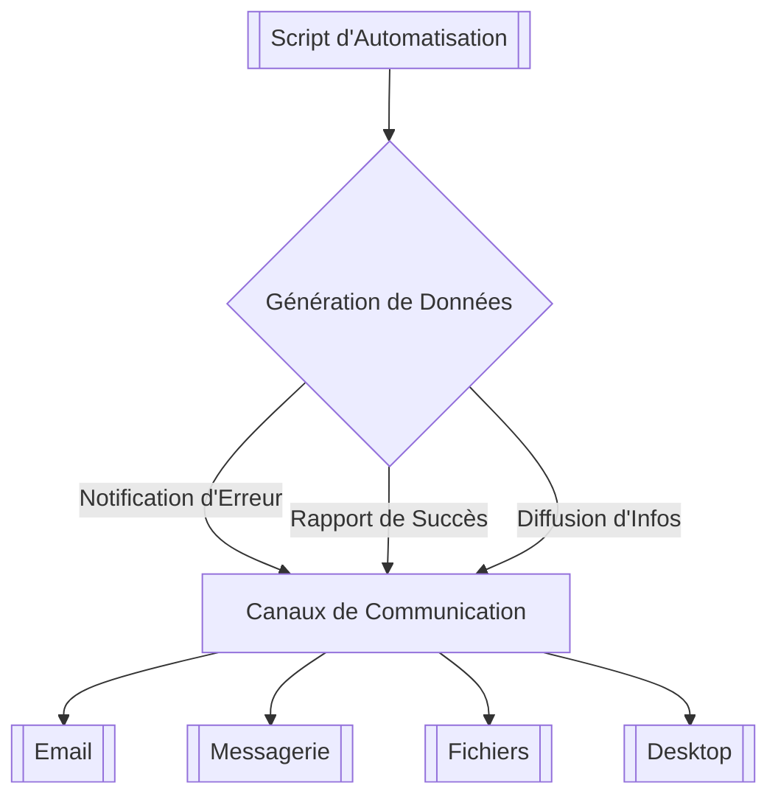

# 04 Communications
L'automatisation ne se limite pas à l'exécution de tâches ; elle inclut souvent la nécessité de **communiquer** les résultats, les alertes, les rapports, ou de solliciter des entrées humaines. Intégrer des capacités de communication dans vos scripts rend vos automatisations plus robustes, plus collaboratives et plus utiles.

### Pourquoi Intégrer la Communication dans l'Automatisation ?

* **Notifications d'Erreurs :** Être alerté immédiatement si une automatisation échoue ou rencontre un problème.
* **Rapports de Succès :** Confirmer que des tâches importantes se sont déroulées comme prévu.
* **Diffusion d'Informations :** Partager les résultats de l'automatisation (rapports, analyses, listes) avec les parties prenantes.
* **Interactions Utilisateur :** Demander une approbation ou une information à un utilisateur avant de poursuivre un workflow.
* **Collaboration d'Équipe :** S'intégrer aux outils de communication d'équipe pour des alertes et des informations partagées.

### Canaux de Communication Courants

Vos automatisations peuvent communiquer via plusieurs canaux, chacun adapté à des besoins spécifiques.

#### 1. E-mails

L'e-mail est un canal universel et asynchrone, idéal pour :
* **Alertes critiques :** Indisponibilité de service, échec de processus.
* **Rapports récapitulatifs :** Rapports quotidiens/hebdomadaires.
* **Notifications :** Confirmation d'une tâche accomplie.

* **Outils Python :**
    * `smtplib` : Pour envoyer des e-mails via un serveur SMTP (simple et bas niveau).
    * `email` : Pour construire des messages e-mail complexes (MIMEText, MIMEBase, pièces jointes, HTML).
    * `mailjet_rest`, `sendgrid-python` : Pour les APIs de services d'envoi d'e-mails en masse (plus robustes pour la production).

#### 2. Messages Instantanés (Slack, Microsoft Teams, Telegram)

Les plateformes de messagerie d'équipe sont excellentes pour des notifications en temps réel, des alertes plus "légères" et pour la collaboration.

* **Alertes immédiates :** Notifications qu'une tâche est terminée ou qu'une anomalie est détectée.
* **Statut en temps réel :** Mises à jour sur le progrès d'un long processus.
* **Interactions simples :** Chatbots basiques qui répondent à des commandes.

* **Outils Python :**
    * `slack_sdk` (pour Slack) : Bibliothèque officielle pour interagir avec l'API Slack.
    * `pymsteams` (pour Microsoft Teams) : Pour envoyer des messages via des webhooks Teams.
    * `python-telegram-bot` (pour Telegram) : Bibliothèque pour créer des bots Telegram.

#### 3. Fichiers et Rapports (CSV, PDF, HTML)

Le stockage de résultats dans des fichiers est une forme de communication indirecte, mais très efficace pour partager des données structurées ou des documents complexes.

* **Rapports d'activité :** CSV des transactions, PDF de résumé, tableau de bord HTML.
* **Export de données :** Fichiers Excel/CSV pour analyse.
* **Logs :** Journaux d'exécution pour le débogage et l'audit.

* **Outils Python :**
    * `pandas` : Pour exporter des DataFrames en CSV, Excel, JSON.
    * `reportlab`, `WeasyPrint` : Pour générer des PDF.
    * `jinja2` : Pour générer du HTML à partir de templates.

#### 4. Interfaces Utilisateur Simples (CLI, Notifications Desktop)

Pour des scripts exécutés localement, des interactions simples peuvent suffire.

* **Invite de commande :** Demander une entrée à l'utilisateur (`input()`).
* **Notifications Desktop :** Pop-ups pour des alertes non intrusives.

* **Outils Python :**
    * `input()` : Pour des entrées simples en console.
    * `plyer` : Pour des notifications desktop multiplateformes.


*Figure 11 : Canaux de communication pour l'automatisation*

### Exemples Pratiques d'Automatisation

#### Exemple 1 : Notification Simple par Email

Reprenons et simplifions l'envoi d'email de votre cas pratique.

```python
# communications_demo.py (partie 1)
import smtplib
from email.mime.text import MIMEText
import os
from dotenv import load_dotenv

load_dotenv() # Assurez-vous que votre .env est accessible

def send_simple_email(subject, body, to_email):
    """Envoie un e-mail simple."""
    sender_email = os.getenv("EMAIL_SENDER")
    sender_password = os.getenv("EMAIL_PASSWORD")
    smtp_server = os.getenv("SMTP_SERVER")
    smtp_port = int(os.getenv("SMTP_PORT", 587))

    if not all([sender_email, sender_password, smtp_server, to_email]):
        print("Erreur: Les informations d'email sont incomplètes dans le .env ou l'appel de fonction.")
        return False

    msg = MIMEText(body, 'plain', 'utf-8')
    msg['Subject'] = subject
    msg['From'] = sender_email
    msg['To'] = to_email

    try:
        with smtplib.SMTP(smtp_server, smtp_port) as server:
            server.starttls()
            server.login(sender_email, sender_password)
            server.send_message(msg)
        print(f"E-mail '{subject}' envoyé avec succès à {to_email}.")
        return True
    except Exception as e:
        print(f"Échec de l'envoi de l'e-mail : {e}")
        return False

# Utilisation (nécessite le fichier .env configuré)
# send_simple_email("Rapport d'automatisation quotidien", "Bonjour,\n\nVotre processus de scraping s'est terminé avec succès.\n\nCordialement,\nVotre Bot", os.getenv("EMAIL_RECEIVER"))
```

#### Exemple 2 : Envoyer un Message à Slack (Webhooks)

De nombreuses plateformes de messagerie d'équipe supportent les webhooks entrants, un moyen simple d'envoyer des messages sans API complexe.

* **Pré-requis :** Créez un **webhook entrant** dans votre espace de travail Slack (ou canal Teams). Cela vous donnera une URL de webhook unique.

```python
# communications_demo.py (partie 2)
import requests
import json
import os
from dotenv import load_dotenv

load_dotenv()

def send_slack_message(message, webhook_url):
    """Envoie un message à un canal Slack via un webhook."""
    if not webhook_url:
        print("Erreur: URL de webhook Slack non configurée.")
        return False

    headers = {'Content-type': 'application/json'}
    payload = {'text': message}

    try:
        response = requests.post(webhook_url, headers=headers, data=json.dumps(payload))
        response.raise_for_status() # Lève une erreur pour les codes 4xx/5xx
        print("Message Slack envoyé avec succès.")
        return True
    except requests.exceptions.RequestException as e:
        print(f"Erreur lors de l'envoi du message Slack : {e}")
        return False

# Utilisation (ajoutez SLACK_WEBHOOK_URL="votre_webhook_url_slack" dans votre .env)
# SLACK_WEBHOOK_URL = os.getenv("SLACK_WEBHOOK_URL")
# send_slack_message("🚨 Alerte : La base de données est en panne ! Vérifiez immédiatement.", SLACK_WEBHOOK_URL)
# send_slack_message("✅ Tâche quotidienne terminée. Rapport disponible sur le drive.", SLACK_WEBHOOK_URL)
```

**Pour exécuter ces exemples dans JupyterLab :**

1.  Créez un nouveau notebook `04_Communications.ipynb`.
2.  Dans le même dossier que votre notebook, créez ou mettez à jour votre fichier `.env` avec les variables `EMAIL_SENDER`, `EMAIL_PASSWORD`, `SMTP_SERVER`, `SMTP_PORT`, `EMAIL_RECEIVER` et `SLACK_WEBHOOK_URL`.
3.  Collez le code des fonctions dans des cellules séparées.
4.  Dans des cellules distinctes, appelez les fonctions avec leurs exemples d'utilisation.

### Conseils et Bonnes Pratiques

* **Sécurité des Accès :** Toujours utiliser des **variables d'environnement** (`.env`) pour stocker les mots de passe, les clés API, les URLs de webhook. Ne jamais les coder en dur dans vos scripts.
* **Messages Clairs et Concis :** Surtout pour les alertes. Un message clair avec les informations essentielles (quoi, quand, où, quelle action nécessaire) est crucial.
* **Limiter les Notifications :** Évitez de "spammer" les utilisateurs. N'envoyez des notifications que lorsque c'est nécessaire. Utilisez des seuils ou des agrégations si les événements sont fréquents.
* **Personnalisation :** Utilisez des templates ou des LLM (comme Ollama) pour personnaliser les messages en fonction des données ou du destinataire.
* **Fallback :** Prévoyez toujours un plan B en cas d'échec de la communication (ex: si l'envoi d'e-mail échoue, écrivez une alerte critique dans les logs).
* **Tests :** Testez toujours vos notifications dans un environnement non-production avant de les déployer.

### Tableau Récapitulatif : Canaux et Outils de Communication

| Canal de Communication | Outils Python Principaux       | Cas d'Usage Recommandé              | Avantages                         | Inconvénients                     |
| :------------------- | :----------------------------- | :---------------------------------- | :-------------------------------- | :-------------------------------- |
| **E-mails** | `smtplib`, `email`, `dotenv`   | Alertes critiques, rapports réguliers | Universel, asynchrone             | Peut être lent, spam potentiel    |
| **Messagerie Instantanée** | `requests`, `slack_sdk`, `pymsteams` | Alertes temps réel, notifications brèves | Immediat, collaboratif            | Peut être intrusif, demande des configurations de webhook |
| **Fichiers/Rapports** | `pandas`, `reportlab`, `jinja2` | Partage de données structurées, archives | Persistant, formaté               | Nécessite une consultation active |
| **Interface Utilisateur Simple** | `input()`, `plyer`           | Interactions locales, alertes desktop | Simple, direct (local)            | Non adapté aux environnements distants |
