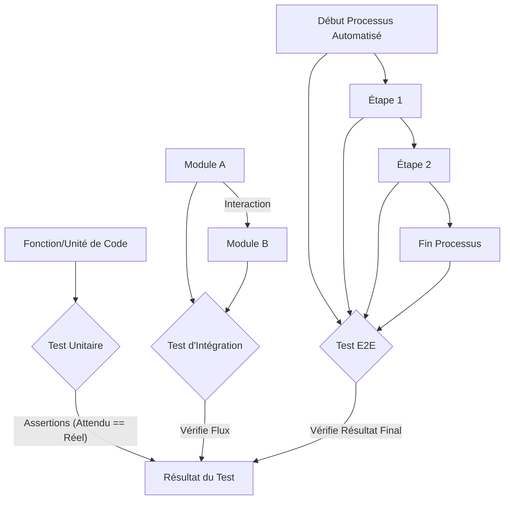

# 03 Tests logiciels

L'automatisation, c'est écrire du code pour exécuter des tâches. Et comme tout code, il est essentiel de le **tester** pour s'assurer qu'il fonctionne correctement, qu'il gère les cas d'erreur et qu'il continue de fonctionner après des modifications. Les tests logiciels sont une composante souvent négligée mais absolument critique pour construire des automatisations robustes et fiables.

### Pourquoi Tester Votre Code d'Automatisation ?

* **Fiabilité :** Assure que votre automatisation fait ce qu'elle est censée faire, de manière constante.
* **Détection Précoce des Bugs :** Identifie les problèmes dès le début du cycle de développement, quand ils sont les moins chers à corriger.
* **Prévention des Régressions :** Garantit que de nouvelles modifications n'introduisent pas de nouveaux bugs ou ne cassent pas des fonctionnalités existantes.
* **Confiance :** Donne confiance dans le déploiement et l'exécution de vos automatisations, surtout pour les tâches critiques.
* **Maintenance Facilitée :** Un code bien testé est plus facile à comprendre et à modifier pour d'autres développeurs (ou votre futur vous).
* **Amélioration de la Qualité du Code :** Écrire des tests encourage à concevoir un code plus modulaire et plus testable.

### Concepts Clés des Tests

* **Tests Unitaires :** Testent les plus petites "unités" de code isolément (fonctions, méthodes). Ils sont rapides à écrire et à exécuter.
* **Tests d'Intégration :** Testent l'interaction entre différentes unités de code ou entre votre code et des systèmes externes (bases de données, APIs).
* **Tests Fonctionnels / End-to-End (E2E) :** Testent une fonctionnalité complète du point de vue de l'utilisateur, en simulant le flux de travail de bout en bout.
* **Assertion :** Une affirmation dans un test qui vérifie si une condition est vraie (ex: "est-ce que le résultat est égal à 5 ?"). Si l'assertion échoue, le test échoue.
* **Fixture :** Des données ou un état d'environnement préparés pour l'exécution d'un test (ex: un fichier temporaire, une connexion à une base de données factice).
* **Mocking / Stubbing :** Remplacer des dépendances réelles (comme une API externe ou une base de données) par des objets simulés pour isoler l'unité testée et rendre le test plus rapide et fiable.


*Figure 15 : Types de tests logiciels*

### Outils Python pour les Tests

Python a un écosystème de tests très mature.

#### 1. `unittest` (Bibliothèque Standard)

Le module `unittest` est le framework de test intégré à Python, inspiré de JUnit en Java.

* **Points forts :**
    * Fait partie de la bibliothèque standard, pas d'installation nécessaire.
    * Supporte les tests unitaires et les tests d'intégration.
    * Classes de test, méthodes `setUp`/`tearDown` pour les fixtures.
* **Quand l'utiliser :** Pour les projets simples ou si vous préférez n'utiliser que des outils intégrés.

#### 2. `pytest` (Recommandé pour sa Flexibilité)

**`pytest`** est un framework de test tiers très populaire, connu pour sa syntaxe concise et ses fonctionnalités avancées.

* **Points forts :**
    * **Syntaxe Simple :** Écrire des tests est plus intuitif, souvent juste des fonctions avec des assertions.
    * **Fixtures Puissantes :** Système de fixtures très flexible pour la préparation des tests.
    * **Plugins :** Vaste écosystème de plugins (couverture de code, rapports, etc.).
    * **Auto-découverte :** Trouve automatiquement les tests à exécuter.
* **Quand l'utiliser :** Pour la plupart des projets Python, des petits scripts aux grandes applications. C'est le choix de prédilection de beaucoup de développeurs.

#### 3. `mock` (Simulation de Dépendances)

Le module `unittest.mock` (souvent importé simplement comme `mock`) est essentiel pour les tests unitaires. Il permet de remplacer temporairement des parties de votre système par des objets "mock" qui enregistrent la manière dont ils sont utilisés ou qui renvoient des valeurs prédéfinies.

* **Points forts :**
    * Isoler les unités de code testées.
    * Simuler des comportements complexes ou des systèmes externes.
    * Vérifier si certaines méthodes ont été appelées et avec quels arguments.
* **Quand l'utiliser :** Quand vous testez une fonction qui dépend d'un service externe (API, base de données, système de fichiers, etc.) et que vous ne voulez pas que le test interagisse réellement avec ce service.

### Exemple Pratique : Tester une Fonction de Traitement de Fichiers

Nous allons écrire une fonction qui lit un fichier CSV, filtre des données et écrit un nouveau CSV. Puis, nous écrirons des tests unitaires pour cette fonction en utilisant `pytest` et `mock`.

**Pré-requis :**
1.  Installez `pytest` : `pip install pytest`

**Fichier `data_processor.py` (La fonction à tester) :**

```python
# tests_demo/data_processor.py
import csv
import os

def process_csv_data(input_filepath, output_filepath, threshold_value):
    """
    Lit un fichier CSV, filtre les lignes où la valeur de la colonne 'Value' est supérieure au seuil,
    et écrit les résultats dans un nouveau fichier CSV.
    """
    if not os.path.exists(input_filepath):
        raise FileNotFoundError(f"Fichier d'entrée non trouvé: {input_filepath}")

    filtered_rows = []
    try:
        with open(input_filepath, mode='r', newline='', encoding='utf-8') as infile:
            reader = csv.DictReader(infile)
            if 'Value' not in reader.fieldnames:
                raise ValueError("La colonne 'Value' est manquante dans le fichier d'entrée.")
            
            for row in reader:
                try:
                    # Convertir la valeur en float pour la comparaison
                    if float(row['Value']) > threshold_value:
                        filtered_rows.append(row)
                except ValueError:
                    # Gérer les cas où 'Value' n'est pas un nombre
                    print(f"Avertissement: Valeur non numérique trouvée dans la colonne 'Value': {row['Value']}")
                    continue

        if not filtered_rows:
            print("Aucune ligne ne correspond aux critères de filtre.")
            return

        # Écrire les résultats
        with open(output_filepath, mode='w', newline='', encoding='utf-8') as outfile:
            fieldnames = reader.fieldnames # Utiliser les noms de colonnes originaux
            writer = csv.DictWriter(outfile, fieldnames=fieldnames)
            writer.writeheader()
            writer.writerows(filtered_rows)
        print(f"Données filtrées écrites dans: {output_filepath}")
        return True

    except Exception as e:
        print(f"Une erreur est survenue lors du traitement des données: {e}")
        return False

# # Exemple d'utilisation (peut être commenté pour les tests)
# if __name__ == "__main__":
#     # Créez un fichier input.csv pour tester
#     # with open("input.csv", "w", newline='') as f:
#     #     writer = csv.writer(f)
#     #     writer.writerow(['ID', 'Name', 'Value'])
#     #     writer.writerow(['1', 'ItemA', '100'])
#     #     writer.writerow(['2', 'ItemB', '50'])
#     #     writer.writerow(['3', 'ItemC', '120'])
#     #     writer.writerow(['4', 'ItemD', 'abc'])
#     
#     # process_csv_data("input.csv", "output.csv", 90)
```

**Fichier `test_data_processor.py` (Les tests avec `pytest`) :**

```python
# tests_demo/test_data_processor.py
import pytest
import os
from unittest.mock import patch, mock_open # patch pour remplacer, mock_open pour simuler des fichiers
from data_processor import process_csv_data # Importer la fonction à tester

# Fixture pytest pour créer des fichiers temporaires pour les tests
@pytest.fixture
def temp_csv_files(tmp_path):
    """Crée un fichier CSV d'entrée temporaire et un chemin pour le fichier de sortie."""
    input_csv_content = (
        "ID,Name,Value\n"
        "1,ItemA,100\n"
        "2,ItemB,50\n"
        "3,ItemC,120\n"
        "4,ItemD,abc\n" # Ligne avec valeur non numérique
        "5,ItemE,200\n"
    )
    input_file = tmp_path / "test_input.csv"
    input_file.write_text(input_csv_content)

    output_file = tmp_path / "test_output.csv"
    
    # Retourne les chemins d'accès pour les utiliser dans les tests
    return str(input_file), str(output_file)

def test_process_csv_data_success(temp_csv_files):
    """Teste le scénario de succès avec des données valides."""
    input_path, output_path = temp_csv_files
    
    # Exécuter la fonction avec un seuil de 90
    result = process_csv_data(input_path, output_path, 90)
    
    # Assertions
    assert result is True # La fonction devrait retourner True en cas de succès
    assert os.path.exists(output_path) # Le fichier de sortie devrait exister

    # Vérifier le contenu du fichier de sortie
    with open(output_path, 'r', newline='', encoding='utf-8') as f:
        reader = csv.DictReader(f)
        rows = list(reader)
        
        assert len(rows) == 3 # Trois lignes devraient correspondre (100, 120, 200)
        assert rows[0]['ID'] == '1'
        assert rows[1]['ID'] == '3'
        assert rows[2]['ID'] == '5'
        assert rows[0]['Value'] == '100'

def test_process_csv_data_file_not_found():
    """Teste le scénario où le fichier d'entrée n'existe pas."""
    with pytest.raises(FileNotFoundError, match="Fichier d'entrée non trouvé"):
        process_csv_data("non_existent_file.csv", "output.csv", 100)

def test_process_csv_data_missing_column(temp_csv_files):
    """Teste le scénario où une colonne essentielle est manquante."""
    input_path, output_path = temp_csv_files
    
    # Simuler un fichier CSV sans la colonne 'Value'
    with patch("builtins.open", mock_open(read_data="ID,Name,OtherColumn\n1,Test,123")):
        with pytest.raises(ValueError, match="La colonne 'Value' est manquante"):
            process_csv_data(input_path, output_path, 100)

def test_process_csv_data_no_matching_rows(temp_csv_files):
    """Teste le scénario où aucune ligne ne correspond au filtre."""
    input_path, output_path = temp_csv_files
    
    # Exécuter la fonction avec un seuil élevé pour qu'aucune ligne ne corresponde
    process_csv_data(input_path, output_path, 300) # Aucune valeur ne dépasse 300
    
    assert not os.path.exists(output_path) # Le fichier de sortie ne devrait pas être créé
    # Si la fonction écrivait un fichier vide, cette assertion serait différente

def test_process_csv_data_with_non_numeric_values_ignored(temp_csv_files, capsys):
    """Teste que les lignes avec des valeurs non numériques sont ignorées et qu'un avertissement est émis."""
    input_path, output_path = temp_csv_files
    
    process_csv_data(input_path, output_path, 90)
    
    # capsys permet de capturer la sortie standard (print)
    captured = capsys.readouterr()
    assert "Avertissement: Valeur non numérique trouvée dans la colonne 'Value': abc" in captured.out
    
    # Vérifier le contenu pour s'assurer que la ligne 'abc' a été ignorée
    with open(output_path, 'r', newline='', encoding='utf-8') as f:
        reader = csv.DictReader(f)
        rows = list(reader)
        assert len(rows) == 3 # Seulement les 3 lignes numériques valides devraient être là
```

**Pour exécuter ces tests dans JupyterLab :**

1.  Créez un dossier `tests_demo/`.
2.  Créez le fichier `data_processor.py` à l'intérieur.
3.  Créez le fichier `test_data_processor.py` à l'intérieur.
4.  Ouvrez votre terminal (ou utilisez le terminal de JupyterLab).
5.  Naviguez jusqu'au dossier `tests_demo/`.
6.  Exécutez la commande : `pytest`
7.  Vous verrez les résultats des tests s'afficher dans le terminal. Si tout est correct, tous les tests devraient passer.

### Conseils et Bonnes Pratiques

* **Tests Automatiques :** Intégrez vos tests dans votre pipeline CI/CD (intégration continue/déploiement continu) pour qu'ils s'exécutent automatiquement à chaque modification du code.
* **Test-Driven Development (TDD) :** Écrivez les tests avant d'écrire le code. Cela force une meilleure conception et garantit que le code est testable.
* **Couverture de Code :** Utilisez des outils comme `pytest-cov` pour mesurer la couverture de code (le pourcentage de votre code qui est exercé par vos tests).
* **Tests de Régression :** Lorsque vous corrigez un bug, écrivez un test qui reproduit ce bug. Ce test doit échouer avant la correction et réussir après, et il garantira que le bug ne réapparaîtra plus.
* **Lisibilité :** Les tests doivent être faciles à lire et à comprendre. Un bon test raconte une histoire : préparez l'environnement, exécutez l'action, vérifiez les résultats.
* **Indépendance des Tests :** Chaque test doit être indépendant des autres. Ils doivent pouvoir être exécutés dans n'importe quel ordre sans affecter les résultats.
* **Rapidité :** Les tests unitaires doivent être très rapides. Si un test prend du temps, c'est peut-être un signe qu'il s'agit d'un test d'intégration ou qu'il utilise des ressources réelles (réseau, base de données) et devrait être mocké.

### Tableau Récapitulatif : Outils de Tests Logiciels

| Outil           | Description                                       | Cas d'Usage Recommandé              | Avantages                                  |
| :-------------- | :------------------------------------------------ | :---------------------------------- | :----------------------------------------- |
| **`unittest`** | Framework de test intégré à Python                  | Projets simples, pas de dépendances externes | Inclus avec Python, familier aux xUnit     |
| **`pytest`** | Framework de test tiers, puissant et flexible     | La plupart des projets Python (recommandé) | Syntaxe simple, fixtures puissantes, plugins |
| **`unittest.mock` (`mock`)** | Pour simuler des objets et des dépendances externes | Tests unitaires isolés, simulation de comportements | Isolation des tests, rapidité, gestion des dépendances |
