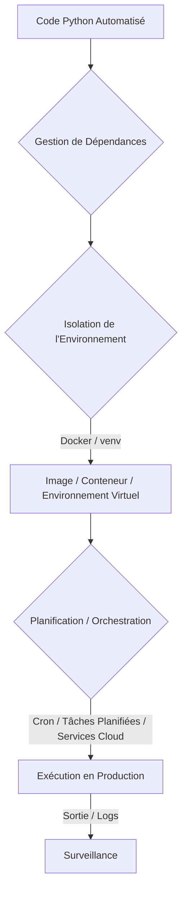
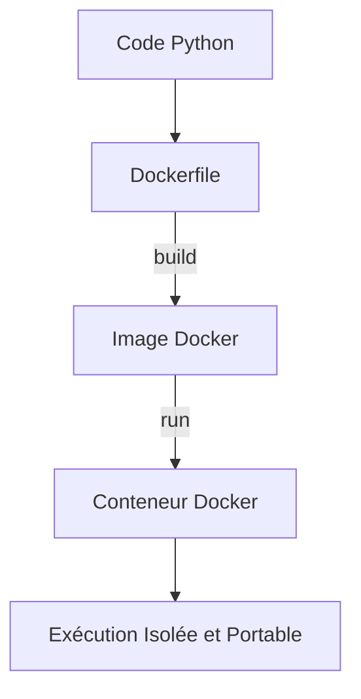

# 01 Execution et deploiement
Une fois que votre script d'automatisation est développé et testé, la prochaine étape cruciale est de le faire passer en "production" – c'est-à-dire de le rendre opérationnel et de l'exécuter de manière fiable et autonome. Cela implique des considérations sur son exécution et son déploiement.

### Pourquoi la Phase d'Exécution et de Déploiement est Cruciale ?

* **Fiabilité :** Assurer que le script s'exécute à l'heure, sans intervention manuelle et malgré les imprévus (redémarrage du serveur, problèmes réseau).
* **Scalabilité :** Préparer le script à gérer une augmentation de la charge ou des besoins.
* **Sécurité :** Exécuter le script avec les privilèges minimaux nécessaires et protéger les informations sensibles.
* **Visibilité :** Savoir si le script s'est exécuté avec succès ou a rencontré des problèmes.
* **Maintenance :** Faciliter les mises à jour et les corrections de bugs.

### Concepts Clés

* **Environnement d'Exécution :** L'ensemble des logiciels, bibliothèques et configurations nécessaires au script pour fonctionner (versions de Python, packages installés, variables d'environnement).
* **Virtualisation / Conteneurisation :** Des technologies pour isoler l'environnement de votre application (machines virtuelles, Docker).
* **Orchestration :** La gestion automatisée de l'exécution, du dimensionnement et de la disponibilité des applications (Kubernetes, outils de CI/CD).
* **Planification (Scheduling) :** Définir quand et à quelle fréquence un script doit s'exécuter (Cron, Tâches Planifiées, services cloud).
* **Déploiement :** Le processus de mise en place de votre code d'un environnement de développement vers un environnement de production.
* **CI/CD (Continuous Integration / Continuous Deployment) :** Des pratiques et outils qui automatisent la construction, le test et le déploiement du code.


*Figure 16 : Cycle d'exécution et de déploiement d'une automatisation*

### Outils et Méthodes pour l'Exécution et le Déploiement

#### 1. Gestion de l'Environnement Python

* **Environnements Virtuels (`venv` ou `conda`) :** C'est la première étape. Isolez les dépendances de votre projet pour éviter les conflits et assurer la reproductibilité.
    ```bash
    python -m venv my_automation_env
    source my_automation_env/bin/activate # Ou .\my_automation_env\Scripts\activate pour Windows
    pip install -r requirements.txt
    ```
* **Fichier `requirements.txt` :** Listez toutes les dépendances de votre projet.
    ```bash
    pip freeze > requirements.txt
    ```

#### 2. Planification des Tâches

* **Linux/macOS : Cron Jobs**
    Un cron job est une tâche planifiée sur les systèmes Unix-like.
    ```bash
    # Éditer les cron jobs (crontab -e)
    # Exécuter mon_script.py tous les jours à 2h du matin
    0 2 * * * /path/to/my_automation_env/bin/python /path/to/my_script.py >> /var/log/my_script.log 2>&1
    ```
    * **Avantages :** Simple, natif.
    * **Inconvénients :** Pas de gestion des erreurs avancée, sortie standard limitée, dépend du serveur.

* **Windows : Tâches Planifiées (Task Scheduler)**
    L'équivalent de cron sous Windows. Configurez-les via l'interface graphique ou la ligne de commande (`schtasks`).
    * **Avantages :** Natif, interface graphique.
    * **Inconvénients :** Moins scriptable que cron.

* **Services Cloud de Planification :**
    * **AWS Lambda / Google Cloud Functions / Azure Functions :** Exécuter du code sans serveur, déclenché par des événements ou des plannings. Idéal pour les petits scripts.
    * **AWS Step Functions / Azure Logic Apps / Google Cloud Workflows :** Orchestrer des workflows complexes impliquant plusieurs étapes et services.
    * **Apache Airflow / Prefect / Dagster :** Des plateformes d'orchestration de workflows de données complexes, très utilisées pour les ETL et les pipelines de ML.

#### 3. Conteneurisation (Docker)

Docker encapsule votre application et toutes ses dépendances dans un "conteneur", garantissant que le script s'exécutera de la même manière partout.

* **`Dockerfile` :** Décrit comment construire votre image Docker.
    ```dockerfile
    # Dockerfile
    FROM python:3.9-slim-buster # Image de base Python
    WORKDIR /app # Répertoire de travail dans le conteneur
    COPY requirements.txt . # Copie les dépendances
    RUN pip install --no-cache-dir -r requirements.txt # Installe les dépendances
    COPY . . # Copie tout le code de l'application
    CMD ["python", "my_script.py"] # Commande à exécuter au démarrage du conteneur
    ```
* **Avantages :** Isolation, reproductibilité, portabilité, gestion des versions de l'environnement.
* **Inconvénients :** Courbe d'apprentissage initiale, complexité pour les petites tâches.


*Figure 17 : Processus de conteneurisation avec Docker*

#### 4. Déploiement et CI/CD

* **Manuellement :** Copier les fichiers, installer les dépendances, configurer la planification. Pour les petits scripts.
* **Scripts de Déploiement :** Utiliser des scripts Bash/Python pour automatiser le processus de copie et de configuration.
* **Outils de CI/CD (GitHub Actions, GitLab CI/CD, Jenkins) :** Automatiser l'ensemble du pipeline depuis le commit de code jusqu'au déploiement en production, incluant les tests, la construction d'images Docker, et le déploiement sur des serveurs ou services cloud.

### Exemple Pratique : Déploiement d'un Script Simple avec Cron et Docker

Nous allons montrer comment préparer un script pour une exécution planifiée et comment le conteneuriser.

**Fichier `my_daily_report.py` :**

```python
# deployment_demo/my_daily_report.py
import datetime
import os
import smtplib
from email.mime.text import MIMEText
from dotenv import load_dotenv

# Charge les variables d'environnement (assurez-vous d'avoir un .env)
load_dotenv() 

def generate_report():
    """Simule la génération d'un rapport quotidien."""
    report_date = datetime.date.today().strftime("%Y-%m-%d")
    report_content = f"Rapport quotidien généré le {report_date}.\n\n" \
                     f"Simuler ici l'extraction de données, calculs, etc.\n" \
                     f"Ceci est un rapport test."
    print(f"Rapport généré pour le {report_date}.")
    return report_content

def send_report_email(subject, body, to_email):
    """Envoie le rapport par e-mail."""
    sender_email = os.getenv("EMAIL_SENDER")
    sender_password = os.getenv("EMAIL_PASSWORD")
    smtp_server = os.getenv("SMTP_SERVER")
    smtp_port = int(os.getenv("SMTP_PORT", 587))

    if not all([sender_email, sender_password, smtp_server, to_email]):
        print("Erreur: Les informations d'email sont incomplètes dans le .env ou l'appel de fonction.")
        return False

    msg = MIMEText(body, 'plain', 'utf-8')
    msg['Subject'] = subject
    msg['From'] = sender_email
    msg['To'] = to_email

    try:
        with smtplib.SMTP(smtp_server, smtp_port) as server:
            server.starttls()
            server.login(sender_email, sender_password)
            server.send_message(msg)
        print(f"Rapport '{subject}' envoyé avec succès à {to_email}.")
        return True
    except Exception as e:
        print(f"Échec de l'envoi du rapport par e-mail : {e}")
        return False

if __name__ == "__main__":
    report = generate_report()
    
    # Récupérer l'e-mail du destinataire depuis .env
    receiver_email = os.getenv("EMAIL_RECEIVER") 
    if receiver_email:
        send_report_email(f"Rapport Quotidien - {datetime.date.today().strftime('%Y-%m-%d')}", report, receiver_email)
    else:
        print("EMAIL_RECEIVER non configuré dans .env. Le rapport ne sera pas envoyé par e-mail.")

```

**Fichier `requirements.txt` :**

```
# deployment_demo/requirements.txt
python-dotenv
```

**Fichier `Dockerfile` :**

```dockerfile
# deployment_demo/Dockerfile
FROM python:3.9-slim-buster

WORKDIR /app

COPY requirements.txt .
RUN pip install --no-cache-dir -r requirements.txt

# Copiez le script d'automatisation et le fichier .env (si vous le mettez dans l'image, attention aux secrets !)
# Il est souvent préférable d'injecter les secrets via des variables d'environnement Docker
COPY my_daily_report.py .
COPY .env . 

CMD ["python", "my_daily_report.py"]
```

**Pour tester dans JupyterLab (simulations) :**

1.  Créez un dossier `deployment_demo/`.
2.  Créez les fichiers `.env` (avec vos infos email), `my_daily_report.py`, `requirements.txt` et `Dockerfile` à l'intérieur.
3.  **Test manuel du script :**
    ```python
    # Dans une cellule Jupyter
    import sys
    sys.path.append('./deployment_demo')
    import my_daily_report # Exécute le script comme si c'était main
    # Vous devriez voir les prints dans la sortie de la cellule et potentiellement recevoir un email.
    ```
4.  **Construction et exécution Docker (dans un terminal) :**
    * Allez dans le dossier `deployment_demo/`.
    * Construisez l'image : `docker build -t daily-report-automation .`
    * Exécutez le conteneur : `docker run daily-report-automation`
    * Vérifiez que le script s'exécute dans le conteneur et que l'e-mail est envoyé.

**Pour le déploiement réel (hors JupyterLab) :**

* **Avec Cron (sur un serveur Linux) :**
    1.  Copiez `my_daily_report.py`, `requirements.txt` et `.env` (sécurisé) sur le serveur.
    2.  Créez un environnement virtuel et installez les dépendances.
    3.  Ajoutez une ligne à la crontab : `crontab -e`
        `0 9 * * * /path/to/deployment_demo_env/bin/python /path/to/deployment_demo/my_daily_report.py >> /var/log/my_daily_report.log 2>&1` (pour l'exécuter tous les jours à 9h du matin).
* **Avec Docker Compose (pour des déploiements plus complexes) :**
    Créez un `docker-compose.yml` si vous avez plusieurs conteneurs.
    ```yaml
    # docker-compose.yml
    version: '3.8'
    services:
      daily_reporter:
        build: . # Utilise le Dockerfile dans le répertoire courant
        environment:
          # Il est souvent préférable de passer les secrets via l'environnement plutôt que COPY .env
          EMAIL_SENDER: ${EMAIL_SENDER}
          EMAIL_PASSWORD: ${EMAIL_PASSWORD}
          SMTP_SERVER: ${SMTP_SERVER}
          SMTP_PORT: ${SMTP_PORT}
          EMAIL_RECEIVER: ${EMAIL_RECEIVER}
        # Pour planifier, vous auriez besoin d'un outil externe comme un scheduler de conteneur (ex: Kubernetes CronJob)
        # ou un conteneur qui inclut un cron interne (moins recommandé).
    ```

### Tableau Récapitulatif : Exécution et Déploiement

| Méthode/Outil        | Contexte                   | Avantages                                | Inconvénients                                |
| :------------------- | :------------------------- | :--------------------------------------- | :------------------------------------------- |
| **`venv`** | Développement local, déploiement manuel | Isolation des dépendances                | Ne gère pas l'OS ni le système d'exécution   |
| **`cron` / Tâches Planifiées** | Scripts simples sur serveur fixe | Facile à configurer pour tâches récurrentes | Peu de gestion des erreurs, pas de portabilité |
| **Docker** | Conteneurisation de l'application       | Isolation, reproductibilité, portabilité | Courbe d'apprentissage, frais généraux       |
| **Services Cloud (Lambda, Functions)** | Scripts sans serveur, déclenchés par événement | Scalabilité, pas de gestion de serveurs | Coût (si usage intensif), vendor lock-in     |
| **CI/CD** | Déploiement automatisé et continu       | Automatisation complète du pipeline      | Complexité initiale                          |
